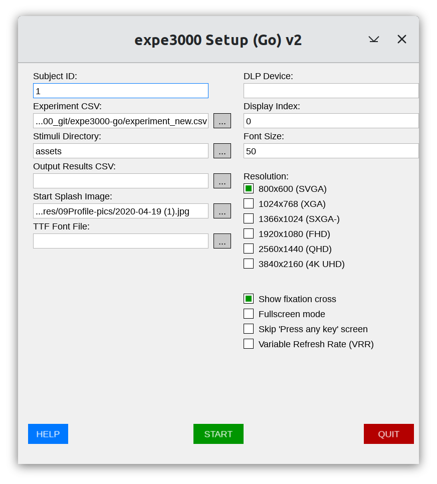

# expe3000 (Go Version)

HTML version of this file: <http://chrplr.github.io/expe3000-go>

Github repository: <http://github.com/chrplr/expe3000-go>

Author: Christophe Pallier <christophe@pallier.org>

Expe3000-go is a multimedia stimulus delivery system designed for experimental psychology and neuroscience tasks requiring accurate timing and low-latency audio.

**Building and running an experiment with expe3000 does not require any programming!** The experiment is fully described in a tabular text file (`.csv` or `.tsv`) that specifies the timings of stimuli.

Stimuli are presented according to a fixed, predefined schedule. Although keypress events are saved with a timestamp, the behavior of the program cannot be modified in real-time (e.g., immediate feedback). There is no notion of "trial" and all button presses are recorded. This approach is suitable for fMRI/MEG/EEG experiments with rigid stimulus presentation schedules.
*Note: If these constraints don't suit your needs and you're looking for a general Go library for psychology experiments, check out [goxpyriment](https://chrplr.github.io/goxpyriment).*


## Experiment Configuration (CSV)

The input CSV or TSV file must include at least these four columns in its header: `onset_time`, `duration`, `type`, and `stimuli`. Extra columns (like `cond`) are allowed and will be preserved in the output log.

**Example (`experiment.csv`):**
```csv
onset_time,duration,type,stimuli
1000,500,IMAGE,body01.png
2000,300,IMAGE_STREAM,face01.png:200:100~face02.png:200:100~face12.png:200:100
3000,500,TEXT,Hello !
4000,2000,BOX,Please press\nany key
7000,1,SOUND,sound02.wav
```

### Stimulus Types
- **IMAGE / SOUND / TEXT**: Standard single-item stimuli.
- **BOX**: Displays multiline text centered on the screen. Use `\n` for literal line breaks within the `stimuli` string.
- **IMAGE_STREAM**: Displays a sequence of images in rapid succession. 
    - The `stimuli` column contains filenames separated by `~`.
    - **Timing (Optional)**: Each item can use the format `filename:duration:gap`.
        - `duration`: Time in ms to show the image.
        - `gap`: Time in ms to show a blank screen (or fixation cross) after the image.
    - If timing is omitted, the value from the `duration` column is used as the frame duration with a 0ms gap.
- **TEXT_STREAM**: Displays a sequence of text strings in rapid succession. Supports the same `:duration:gap` timing format.
- **SOUND_STREAM**: Plays a sequence of sound files. Supports the same `:duration:gap` format, where `duration` is the SOA (Stimulus Onset Asynchrony).

**Notes on Timing:**
- For `SOUND` types, the `duration` column is required but the sound will play until completion (use `1` or any placeholder value).
- All timestamps in the CSV and output logs are in milliseconds.

---

## Features

- **Precise Timing:** High-resolution timing loop with VSYNC synchronization and predictive onset look-ahead.
- **Low-Latency Audio:** Uses a custom software mixer to minimize startup delay and ensure thread-safety.
- **Text Stimuli:** Support for rendering text via TTF fonts.
- **Unified Event Log:** Records stimulus onsets, offsets, and user responses in a single CSV file with a comprehensive metadata header.
- **Splashscreens:** Optional start and end screens that wait for user input.
- **Advanced Display Options:** Supports custom resolutions, logical scaling, and multiple monitors.
- **Cross-Platform:** Binaries available for Linux, Windows, and macOS (x86_64 and ARM64).
- **Serial Triggers:** Support for DLP-IO8-G devices via `go.bug.st/serial` (no CGo required).

---

## Installation

### Precompiled Binaries
Check the [GitHub Releases](https://github.com/chrplr/expe3000-go/releases) for automated builds.
Artifacts are named `expe3000-<version>-<os>-<arch>-binary`. Choose the one matching your system:
- **OS**: `linux`, `windows`, or `macos`.
- **Architecture**: `x86_64` (Intel/AMD) or `arm64` (Apple Silicon/ARM).

### Building from Source

#### Prerequisites
- **Go 1.25** or later (only if building from source).
- **SDL3 libraries**: 
  - **Windows**: DLLs are typically bundled with releases.
  - **macOS**: `brew install sdl3 sdl3_image sdl3_ttf`
  - **Linux**: Install `sdl3`, `sdl3_image`, and `sdl3_ttf` via your package manager (e.g., `apt install libsdl3-0 libsdl3-image-0 libsdl3-ttf-0`).


To build both the CLI and GUI versions:
```bash
./build.sh
```
Alternatively:
```bash
go build -o expe3000 ./cmd/expe3000
go build -o expe3000-gui ./cmd/expe3000-gui
```

### Making the commands available from anywhere (Optional)

To run `expe3000` or `expe3000-gui` from any terminal window without typing their full path, you can move them to a "global" location on your computer.

#### Linux & macOS
1. Open a terminal in the folder where your binaries are located.
2. Move the files to a standard system folder (you will be asked for your password):
   ```bash
   sudo mv expe3000 expe3000-gui /usr/local/bin/
   ```
3. **macOS Security Note**: If you downloaded the binaries, macOS may block them from running. You can fix this by running this command in the terminal:
   ```bash
   sudo xattr -dr com.apple.quarantine /usr/local/bin/expe3000*
   ```
   *Alternatively, if you see a "blocked" message when trying to run the app, go to **System Settings > Privacy & Security** and click **"Open Anyway"** at the bottom of the page.*
4. You can now start the program from any folder by simply typing `expe3000` or `expe3000-gui`.

#### Windows
**Option A: Automate with PowerShell (Recommended)**
1. Open the folder where you have downloaded the `.exe` files and `install-windows.ps1`.
2. Right-click on **`install-windows.ps1`** and select **Run with PowerShell**. 
3. If prompted to run as **Administrator**, click **Yes**. The script will automatically copy the files to `C:\Program Files\expe3000-go` and update your system `PATH`.

**Option B: Manual Setup**
1. Create a folder (e.g., `C:\bin`) and move the `.exe` files into it.
2. Press the **Windows Key**, type "environment variables", and select **Edit the system environment variables**.
3. Click the **Environment Variables...** button.
4. In the "User variables" list, select **Path**, then click **Edit...**.
5. Click **New** and type the path to your folder (e.g., `C:\bin`).
6. Click **OK** on all windows to save.
7. Restart any open Command Prompt or PowerShell windows for the changes to take effect.

---

## Usage

There are two apps: a command line one (`expe3000`) and a graphical one (`expe3000-gui`). Here is a screenshot of the graphical interface:



### Quick Start
1. **Launch the GUI**: Run `./expe3000-gui`.
2. **Configure**: 
   - Click **"..."** next to **Experiment CSV** and select `experiment_new.csv`.
   - Ensure **Stimuli Directory** points to the `assets` folder.
3. **Start**: Click the green **START** button. 
4. **Interact**: Press any key when the "Press any key to start" message appears.
5. **Exit**: Press **Escape** at any time to interrupt the experiment.

### GUI Mode
The GUI provides an interactive setup window to configure file paths, resolution, and experimental options (like fixation cross and fullscreen). Settings are automatically cached for the next session.

### CLI Mode
For automated or console-only environments:
```bash
./expe3000 -csv experiment.csv [options]
```
**Common Options:**
- `-csv`: Path to the stimulus CSV or TSV file (required).
- `-stimuli-dir`: Directory containing image and sound assets.
- `-font`: Path to a TTF font file.
- `-output`: Path for the results CSV file (default: `results.csv`).
- `-fullscreen`: Run in fullscreen mode.
- `-dlp`: Serial device path for DLP-IO8-G triggers (e.g., `/dev/ttyUSB0`).

### Linux Performance Note
To minimize video latencies on Linux, run the CLI version from a TTY console (e.g., Ctrl-Alt-F3) after stopping the display manager (e.g., `systemctl stop gdm`). This allows the app to bypass Wayland/X11 and use the **Direct Rendering Manager (DRM)** directly.

# License & Credits

[This app](http://github.com/chrplr/expe3000-go) is a port of [audiovis](https://chrplr.github.io/audiovis/) to Go, using the [go-sdl3](https://github.com/Zyko0/go-sdl3) bindings (see also an [implementation in C](https://github.com/chrplr/expe3000)).

Developed by [Christophe Pallier](http://www.pallier.org) <christophe@pallier.org> using [Gemini CLI](https://github.com/google/gemini-cli).

The code is distributed under the **GNU GPLv3**.

**Assets Note**: Files in the `assets/` folder are NOT public domain. Images were created by Minye Zhan and are used with permission. Do not reuse without her consent.
